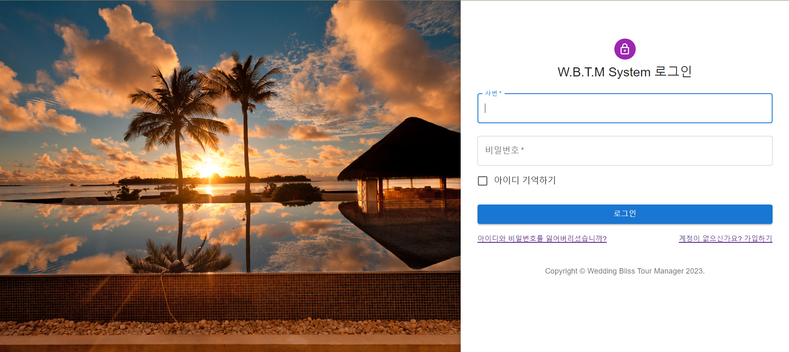
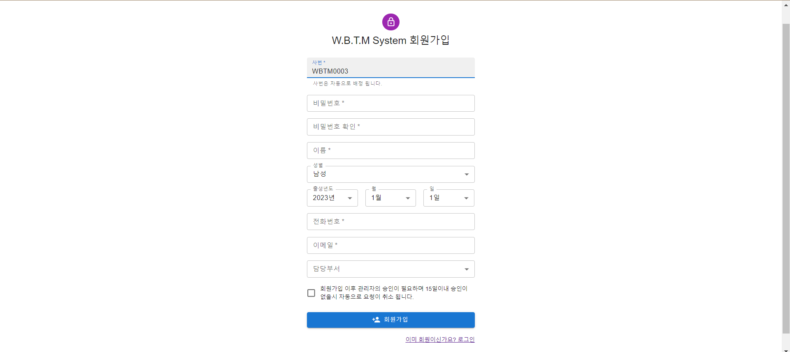

# Trip-Manager 프로젝트

Trip-Manager 프로젝트는 여행 관리와 예약을 위한 웹 애플리케이션입니다. 이 앱은 스프링 부트(백엔드)와 리액트(프론트엔드)를 기반으로 하며 MySQL 5.7 버전을 데이터베이스로 사용합니다. JPA와 Querydsl을 활용하여 데이터베이스 관리를 용이하게 합니다.

## 주요 기술 스택

- 백엔드:
  - 스프링 부트
  - JPA (Java Persistence API)
  - Querydsl
  - MySQL 5.7
  - IDE: IntelliJ IDEA 또는 Eclipse

- 프론트엔드:
  - 리액트
  - IDE: Visual Studio Code (VSCode)

## 프로젝트 설명

Trip-Manager는 여행을 계획하고 예약하는 데 도움을 주는 플랫폼입니다. 사용자는 웹 앱을 통해 여행 일정을 만들고 관리할 수 있으며, 숙박 및 활동 등의 여행 정보를 저장하고 검색할 수 있습니다. 데이터베이스는 MySQL 5.7을 사용하여 백엔드에서 관리되며, JPA와 Querydsl을 활용하여 데이터를 효율적으로 처리합니다.

## 사용 방법

1. 백엔드 설정:
   - 백엔드는 스프링 부트로 구축되었습니다. 백엔드 폴더에서 IDE를 열고 애플리케이션을 실행합니다.

2. 프론트엔드 설정:
   - 프론트엔드는 리액트로 작성되었습니다. 프론트엔드 폴더에서 다음 명령을 실행하여 의존성을 설치하고 앱을 시작합니다:
     ```
     npm install
     #3001 포트를 사용 package.json파일에 수정완료 (mac에서는 export PORT=3001 && / window는 set PORT=3001 &&)
     npm start
     ```
   - 사용된 npm 패키지
   ```
      #emotion/styled : css작성을 보다 용이하게 관리하기 위하여
      npm install @emotion/react @emotion/styled

      #react-router-dom : 컴포넌트간의 이동을 위한 패키지 설치
      npm install react-router-dom

      #http-proxy-middleware : 백엔드 서버와 프론트 엔드 서버간의 연결을 위한 미들웨어 프록시 설치
      npm install http-proxy-middleware

      #axios : 비동기 통신을 위한 패키지 설치
      npm install axios

      #material : 구글에서 제공하는 css 라이브러리 설치
      npm install @mui/material @mui/icons-material
   ```  

3. 데이터베이스 설정:
   - MySQL 5.7을 설치하고 `application.yml` 파일에서 데이터베이스 연결 정보를 구성합니다.

4. 앱 사용:
   - 웹 브라우저에서 `http://localhost:8090`로 앱에 접속합니다. 여행을 계획하고 관리하는 기능을 살펴보세요.

## 라이센스

이 프로젝트는 lebjent 본인 라이센스 이며 본인 허락하에 배포 허가가 됩니다. 

## 기여

이 프로젝트에 기여하려면 GitHub 저장소에서 Fork하여 개선 제안 또는 버그 보고서를 제출하세요. 

## 프로젝트 대표 UI화면

   #### 메인화면(로그인)
   
   
   #### 회원가입 화면
   